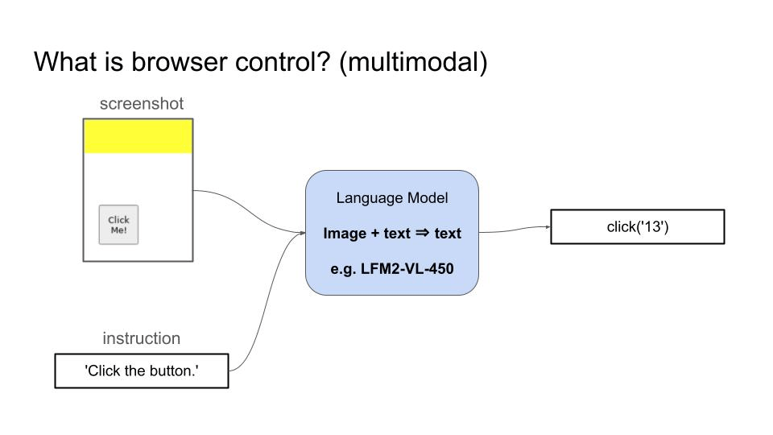
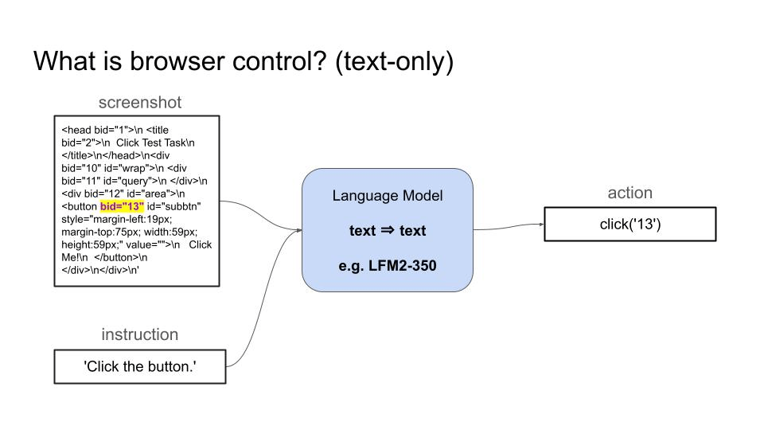
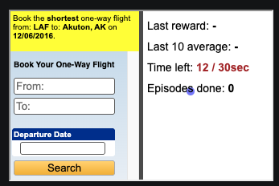
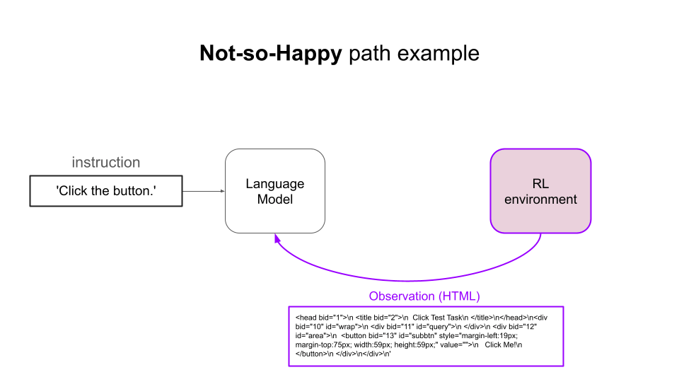
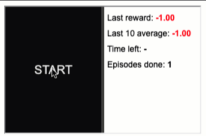
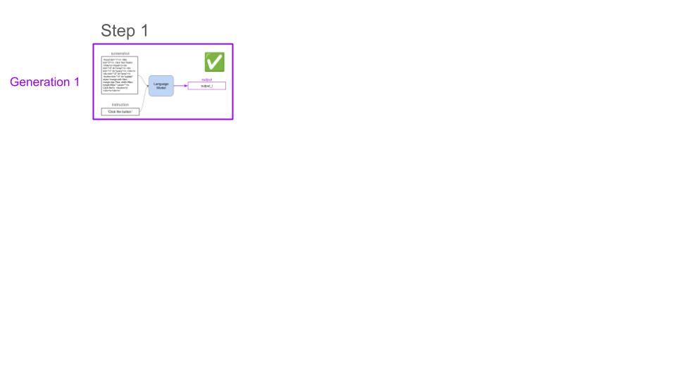
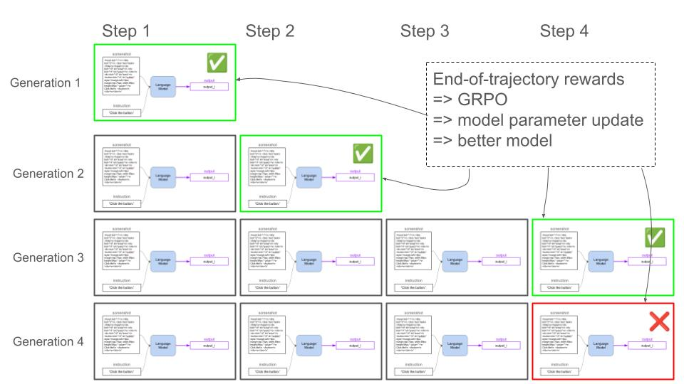

# 🌐 Browser Control with GRPO + Reinforcement Learning

Fine-tune **Qwen2.5-0.5B-Instruct** for browser control using GRPO (Group Relative Policy Optimization) on a local **4GB VRAM GPU**. Uses BrowserGym + MiniWoB++ for the RL environment and WandB for monitoring.

> **100% success rate** on the `click-test` benchmark after SFT warmup + GRPO training.

---

- [What is browser control?](#what-is-browser-control)
- [Real-world use cases](#real-world-use-cases)
- [Why Reinforcement Learning?](#why-reinforcement-learning)
  - [Example](#example)
- [Building blocks](#building-blocks)
  - [1. The environment → BrowserGym](#1-the-environment--browsergym)
  - [2. The RL algorithm → GRPO](#2-the-rl-algorithm--grpo)
  - [3. The policy → Qwen2.5-0.5B-Instruct](#3-the-policy--qwen25-05b-instruct)
- [Architecture](#architecture)
- [Quick Start](#quick-start)
- [Results](#results)
- [Project Structure](#project-structure)
- [References](#references)

---

## What is browser control?

Browser control is the ability of a language model to navigate and interact with websites by generating sequences of actions (clicking elements, typing text, scrolling) to accomplish user-specified tasks like booking flights, filling forms, or extracting information from web pages.

For example:

- A **Vision Language Model (VLM)** can take a screenshot and the user goal as inputs, and generate actions to accomplish that goal.

    

- A **text-only Language Model** can take the accessibility tree (AXTree) of the page and proceed in the same way.

    

> In this project we use the **text-only** approach with accessibility tree observations.

## Real-world use cases

Browser control has many real-world applications:

- **Accessibility assistance**: A companion that navigates complex checkout flows, reads product descriptions, and completes purchases for visually impaired users
- **Healthcare appointment management**: An agent that checks multiple clinic websites for availability, books the earliest slot matching your insurance, and adds it to your calendar
- **Bill payment automation**: A routine that visits utility company websites, verifies amounts, and schedules payments from your bank account
- **Data extraction**: Automated extraction of structured data from websites that don't provide APIs

## Why Reinforcement Learning?

In browser control, there are often **multiple valid ways** to accomplish a goal. Verifying if the model solved the task (RL with verifiable rewards) is way easier/cheaper/faster than collecting a sufficiently large and diverse set of expert demonstrations for Supervised Fine-Tuning.

**Task**: *"Book the shortest one-way flight from LAF to Akuton, AK on 12/06/2016"*



There are many possible ways to solve this problem — from human-like happy paths where the agent fills in fields sequentially, to cases where the agent mistypes, corrects itself, and continues until completion.

Getting expert demonstrations for all these cases for SFT is impractical. An RL environment that verifies at each step if the task is complete provides sparse feedback (reward) that an RL algorithm can use to iteratively improve the model.

Moreover, with RL the model can learn to **course-correct** when things go wrong. SFT models trained only on successful demonstrations often get stuck when they deviate from the expected trajectory.

> **Our approach**: SFT warmup to teach the action format, then GRPO to optimize task performance.

### Example

The RL training loop:

1. The model **observes** the state of the environment (accessibility tree of the website)
2. **Outputs an action** (e.g. `click('13')`)
3. Occasionally obtains a **positive reward** from the environment



By repeating this process long enough, the model gets better at the task.

## Building blocks

### 1. The environment → BrowserGym

[BrowserGym](https://github.com/ServiceNow/BrowserGym) is an open-source collection of browser automation benchmarks:

- [Mini World of Bits++](https://miniwob.farama.org/) (MiniWoB)
- [WebArena](https://github.com/web-arena-x/webarena)
- [VisualWebArena](https://github.com/web-arena-x/visualwebarena)
- [WorkArena](https://github.com/ServiceNow/WorkArena)

MiniWoB is the easiest benchmark — a great starting point. In this repo we use the `click-test` task:



It's simple enough to showcase the whole training pipeline without spending too much time training.

### 2. The RL algorithm → GRPO

As the model interacts with the environment, we collect rollouts with sparse rewards. GRPO adjusts model parameters to increase the chances of getting larger rewards.

Here are 4 rollouts for the same task, where the model solves it in different numbers of steps:



GRPO uses the **relative performance within the group** to determine which actions to reinforce:



Responses that perform better than their groupmates get positive advantages, while worse ones get negative advantages. This is more memory-efficient than PPO since it eliminates the need for a separate value function model.

### 3. The policy → Qwen2.5-0.5B-Instruct

We use [Qwen2.5-0.5B-Instruct](https://huggingface.co/Qwen/Qwen2.5-0.5B-Instruct), a small-yet-capable instruction-tuned model that fits comfortably on a 4GB VRAM GPU.

Since the base model doesn't know BrowserGym action syntax out of the box, we use a **two-phase training approach**:

| Phase | Method | What it does |
|-------|--------|-------------|
| **Phase 1** | SFT Warmup | Teaches the model `click('bid')` action format using 50 supervised examples |
| **Phase 2** | GRPO (RL) | Reinforces correct actions by rewarding task completion |

## Architecture

The system runs in **2 Docker containers** — no vLLM needed:

```
┌──────────────────────────────────────────────┐
│         Docker: training-gpu (GPU)           │
│  ┌────────────────┐  ┌────────────────────┐  │
│  │  SFT Warmup    │  │  GRPOTrainer       │  │
│  │  (Phase 1)     │→ │  (Phase 2 - LoRA)  │  │
│  └────────────────┘  └────────────────────┘  │
│        Qwen2.5-0.5B-Instruct (fp16)          │
│        WandB Logging ──► wandb.ai            │
└──────────────────┬───────────────────────────┘
                   │ HTTP API
                   ▼
┌──────────────────────────────────────────────┐
│         Docker: browsergym-env (CPU)         │
│  ┌────────────────────────────────────────┐  │
│  │  BrowserGym (MiniWoB++ click-test)     │  │
│  │  FastAPI Server + Playwright           │  │
│  └────────────────────────────────────────┘  │
└──────────────────────────────────────────────┘
```

| Component | Description |
|-----------|-------------|
| **Model** | `Qwen/Qwen2.5-0.5B-Instruct` — 0.5B params, fits in 4GB VRAM at fp16 |
| **RL Algorithm** | GRPO via HuggingFace TRL |
| **Environment** | BrowserGym (MiniWoB++ `click-test`) |
| **Fine-tuning** | LoRA (r=8, alpha=16) — no quantization needed |
| **Monitoring** | Weights & Biases (WandB) |

## Quick Start

### Prerequisites

- Docker + Docker Compose
- NVIDIA GPU with 4GB+ VRAM
- NVIDIA Container Toolkit (`nvidia-docker`)
- WandB account (free tier works)

### 1. Setup environment

```bash
git clone https://github.com/Shaktisinhchavda/browser-agent-rl.git
cd browser-agent-rl

# Copy and edit .env (add your WANDB_API_KEY)
cp .env.example .env
```

### 2. Build Docker images

```bash
docker compose build
```

### 3. Train (3-step pipeline)

```bash
# Start the BrowserGym environment
docker compose up -d

# Step 1: SFT Warmup — teach model the action format (~12 min)
docker compose run --rm training-gpu python -m browser_control.sft_warmup qwen2_0.5b_lora.yaml

# Step 2: GRPO Training — RL optimization (~3.5 min)
docker compose run --rm training-gpu python -m browser_control.fine_tune qwen2_0.5b_lora.yaml \
    --sft-checkpoint /model_checkpoints/Qwen2.5-0.5B-Instruct-sft-warmup

# Step 3: Evaluate
docker compose run --rm training-gpu python -m browser_control.evaluate qwen2_0.5b_lora.yaml \
    /model_checkpoints/<GRPO_CHECKPOINT_NAME> \
    --sft-checkpoint /model_checkpoints/Qwen2.5-0.5B-Instruct-sft-warmup
```

### 4. Monitor on WandB

Open [wandb.ai](https://wandb.ai) and look for the project `browser-control-grpo`.

## Results

**10/10 episodes successful (100% accuracy)** on `click-test` after training:

```
--- Episode 1/10 ---
  Step 1: raw="click('13')" → click('13')
   Episode 1: SUCCESS (reward=1.0)

--- Episode 2/10 ---
  Step 1: raw="click('13')" → click('13')
   Episode 2: SUCCESS (reward=1.0)

...

========================================
Results: 10/10 successful (100.0%)
========================================
```

### Training metrics

| Phase | Loss | Duration |
|-------|------|----------|
| SFT Warmup (3 epochs) | 3.99 → 0.001 | ~12 min |
| GRPO (100 steps) | 0.002 | ~3.5 min |

## Configuration

Edit `configs/qwen2_0.5b_lora.yaml` to adjust:

- `learning_rate`, `warmup_steps` — training speed
- `num_generations`, `max_steps` — rollout settings
- `lora_r`, `lora_alpha` — LoRA rank/scaling
- `system_prompt` — action format instructions
- `dataset_size` — number of training prompts

## Project Structure

```
browser-control/
├── configs/
│   └── qwen2_0.5b_lora.yaml        # LoRA config (4GB VRAM)
├── src/
│   └── browser_control/
│       ├── __init__.py
│       ├── config.py                # Pydantic config loader
│       ├── sft_warmup.py            # Phase 1: SFT warmup
│       ├── fine_tune.py             # Phase 2: GRPO training
│       ├── evaluate.py              # Evaluation script
│       ├── env_client.py            # BrowserGym HTTP client
│       └── paths.py                 # Path utilities
├── docker/
│   ├── Dockerfile.training          # GPU training container
│   ├── Dockerfile.browsergym        # BrowserGym env container
│   └── browsergym_server.py         # FastAPI server for BrowserGym
├── media/                           # README images
├── docker-compose.yml
├── pyproject.toml
├── Makefile
└── README.md
```

## References

- **GRPO Paper**: [DeepSeekMath: Pushing the Limits of Mathematical Reasoning in Open Language Models](https://arxiv.org/abs/2402.03300)
- **BrowserGym**: [ServiceNow/BrowserGym](https://github.com/ServiceNow/BrowserGym)
- **MiniWoB++**: [Farama Foundation — MiniWoB](https://miniwob.farama.org/)
- **TRL (Transformer Reinforcement Learning)**: [huggingface/trl](https://github.com/huggingface/trl)
- **Qwen2.5**: [Qwen/Qwen2.5-0.5B-Instruct](https://huggingface.co/Qwen/Qwen2.5-0.5B-Instruct)
- **LoRA**: [LoRA: Low-Rank Adaptation of Large Language Models](https://arxiv.org/abs/2106.09685)

## License

MIT
